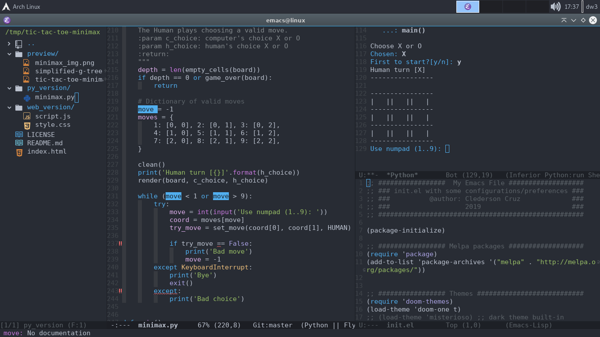

# emacs-file
My Emacs File. This configuration includes:
* Melpa packages (more packages)
* Neotree (instead of sr-speedbar for navigation)
* All-the-icons (for more UX)
* Doom-theme (like Atom theme)
* Auto-pair (<>, "", (), {}, [] etc.)
* Auto-complete (based in used words)
* Flycheck for Python (using Pylint)
* Markdown-mode (sintax highlighting)
* Flymd (mark-down preview)
* Json-mode (json preview)
* Jedi (Python environment)
* Emr (refactoring system)
* ac-html (autocomplete HTML)
* Others

# Preview

<p align="center">
    </img>
</p>

## How to use
```
path=~/.emacs/init.el 
cp $path $path.bak
cp <path-for-this-init.el> $path
```
